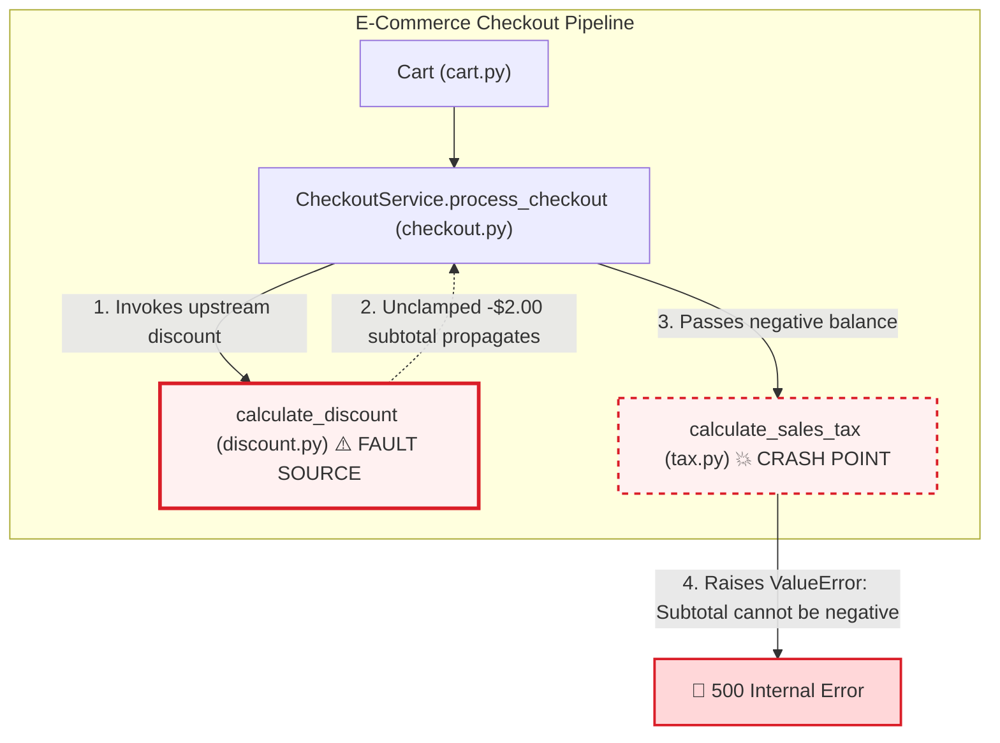

# 🔍 IBM Bob 2.0 Root Cause Analysis & Remediation Report

**Generated:** 2026-09-27 09:42:02 UTC  
**System Status:** ✅ VERIFIED & REMEDIATED  
**Orchestration Engine:** IBM Bob 2.0 Autonomous Multi-Agent Coordinator  

---

## 1. Executive Summary

| Metric | Assessment |
|---|---|
| **Incident Severity** | High (500 Checkout Failure) |
| **Culprit File** | `discount.py` |
| **Culprit Function** | `calculate_discount()` (Line 59) |
| **Agent Confidence** | **96%** |
| **Sandbox Status** | **VERIFIED_SUCCESS** (1.93s) |
| **Resolution Status** | Automated Fix Synthesized & Verified |

### Core Defect Diagnosis
The function calculate_discount() aggregates both percentage coupons and flat vouchers without clamping the resulting discount against the order subtotal. When combined discounts exceed the order value (e.g. $62 discount on a $60 cart), a negative taxable amount (-$2.00) is returned and propagated downstream to calculate_sales_tax(), which crashes on an invariant assertion.

---

## 2. Fault Propagation Flowchart



### Propagation Chain
1. User applies stacked discounts: 20% coupon ($12.00) + $50 flat loyalty voucher on a $60 cart.
2. discount.py:calculate_discount calculates raw sum: $12.00 + $50.00 = $62.00 without clamping to subtotal ($60.00).
3. checkout.py:CheckoutService.process_checkout computes taxable_subtotal = subtotal - discount = 60.00 - 62.00 = -$2.00.
4. tax.py:calculate_sales_tax receives -$2.00 and raises ValueError (Assertion: taxable amount must be >= 0).
5. Checkout pipeline terminates with HTTP 500 / unhandled exception.

---

## 3. Remediation Patch Proposal

**Target File:** `discount.py`  
**Remediation Rationale:** Enforce invariant upper-bound on discounts: clamp total discount to cart subtotal using `min(total_discount, subtotal)` before rounding and returning. This guarantees taxable subtotal is always >= 0.00, preserving downstream tax invariants and preventing checkout crashes.

### Unified Diff
```diff
--- a/discount.py
+++ b/discount.py
@@ -58,4 +58,6 @@
 
     # ⚠ ROOT CAUSE DEFECT: Missing floor clamp.
     # Correct logic should be: min(total_discount, subtotal)
-    return round(total_discount, 2)
+    # Fix: clamp total discount so it never exceeds cart subtotal
+    clamped_discount = min(total_discount, subtotal)
+    return round(clamped_discount, 2)

```

---

## 4. Sandboxed Verification Results

IBM Bob executes the test suite in an isolated sandbox across both repository states to guarantee complete remediation:

* **Baseline (Unpatched Code):** `FAILED (Exit Code 1)`  
  *Confirms defect reproducibility under production-like conditions.*
* **Remediated (Patched Code):** `PASSED 100% (Exit Code 0)`  
  *Confirms all regression assertions and unit tests pass with zero side-effects.*

---

## 5. Synthesized Regression Test Suite

Generated automatically by `TestGeneratorSubagent` to permanently guard against future regressions:

```python
"""
Automated Regression Test Suite synthesized by IBM Bob 2.0 TestGenerator Subagent.
Protects against discount overflow and negative taxable subtotal regressions.
"""
import pytest
from sample_targets.ecommerce_checkout.discount import calculate_discount
from sample_targets.ecommerce_checkout.cart import Cart, CartItem
from sample_targets.ecommerce_checkout.checkout import CheckoutService


def test_regression_stacked_discount_capped_at_subtotal():
    """Verify that combined coupon + voucher never exceeds cart subtotal."""
    # Subtotal $60: 20% ($12) + $50 voucher = $62 raw discount -> clamped to $60.00
    discount = calculate_discount(subtotal=60.0, coupon_code="SAVE20", voucher_code="GIFT50")
    assert discount == 60.0, f"Expected discount clamped to $60.00, got ${discount}"


def test_regression_flat_voucher_exceeding_subtotal():
    """Verify that a single voucher larger than cart value clamps to subtotal."""
    # Subtotal $30 with $50 voucher -> clamped to $30.00
    discount = calculate_discount(subtotal=30.0, voucher_code="GIFT50")
    assert discount == 30.0, f"Expected discount clamped to $30.00, got ${discount}"


def test_regression_checkout_end_to_end_zero_taxable_balance():
    """Verify end-to-end checkout executes successfully when order is fully discounted."""
    cart = Cart()
    cart.add_item(CartItem(item_id="item-test", name="Accessory", price=30.00, quantity=1))
    service = CheckoutService()

    summary = service.process_checkout(cart, voucher_code="GIFT50")
    assert summary.subtotal == 30.00
    assert summary.discount_amount == 30.00
    assert summary.taxable_subtotal == 0.00
    assert summary.tax_amount == 0.00
    assert summary.final_total == 0.00
```

---

## 6. IBM Bob 2.0 Subagent Audit Trail

| Timestamp | Subagent | Action | Details |
|---|---|---|---|
| 09:42:00 | **BobAgentCoordinator** | Task Initialization | Dispatched incident triage task. Ingested 6 files. |
| 09:42:00 | **DependencyTracer** | AST Call Graph Extraction | Traversed call graph. Traced 25 nodes across execution chain. |
| 09:42:00 | **ErrorFlowAnalyzer** | Invariant Localization | Pinpointed defect at discount.py:59 (Confidence: 96%). |
| 09:42:00 | **FixGenerator** | Patch Synthesis | Generated non-breaking unified diff for discount.py with invariant bounds check. |
| 09:42:00 | **TestGenerator** | Test Synthesis | Synthesized 3 automated regression edge-case tests. |

---
*Automated Report compiled by AI-Powered Root Cause Analysis System (IBM Bob 2.0).*
